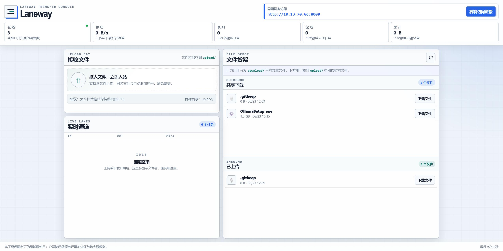

# 🚀 Laneway

<p align="center">
  <strong>📡 一个开箱即用的局域网文件传输台</strong>
</p>

<p align="center">
  <em>Local file transfer console for your trusted LAN.</em>
</p>

<p align="center">
  
  
  
  
</p>

<p align="center">
  <a href="#-快速开始">🚀 快速开始</a> ·
  <a href="#-功能亮点">✨ 功能亮点</a> ·
  <a href="#-使用方式">🧭 使用方式</a> ·
  <a href="#-常见问题">❓ 常见问题</a>
</p>

---

## 👋 Laneway 是什么？

**Laneway** 是一个基于 **FastAPI** 的局域网文件传输工具。

它适合在同一 Wi-Fi / 同一局域网内快速传文件：

- 🔐 不用登录账号
- 📦 不用安装客户端
- ☁️ 不用网盘
- 💬 不用聊天软件
- 🌐 打开浏览器就能上传和下载

把文件放进 `download/`，同网设备就能下载。  
别人从网页上传的文件，会自动保存到 `upload/`。

Laneway 启动后会自动打开浏览器，并显示局域网访问链接。把这个链接发给同一局域网内的手机、平板或电脑，就可以开始传文件。



---

## ✨ 功能亮点

### ⚡ 一键启动

双击 `start.bat` 即可启动。脚本会自动：

- 🐍 创建 `.venv` 虚拟环境
- 🚄 使用清华 PyPI 镜像源安装依赖
- 🧩 启动 FastAPI 服务
- 🌐 自动打开浏览器
- 📡 在终端显示局域网访问地址

### 📁 局域网共享下载

把文件放入：

```text
download/
```

网页右侧的 **共享下载** 区域会显示这些文件，同网设备可以直接下载。

### ⬆️ 拖拽上传

其他设备打开 Laneway 页面后，可以点击选择文件，也可以直接拖拽上传。

上传后的文件会保存到：

```text
upload/
```

并显示在网页右侧的 **已上传** 区域。

### 🗂️ 上下双文件货架

页面右侧同时显示两个区域：

```text
共享下载
已上传
```


### 📊 实时状态面板

顶部状态栏实时显示：

- 👥 在线人数
- ⚡ 当前总传输速度
- 🔄 正在传输的任务数
- ✅ 已完成任务数
- 💾 累计传输量

### 🚚 传输进度追踪

上传和下载都会显示：

- 📄 文件名
- ↕️ 传输方向
- 📈 传输进度
- ⚡ 当前速度
- 📦 已传输大小

### 🔗 一键复制局域网链接

页面顶部会自动显示局域网访问地址，例如：

```text
http://192.168.1.23:8000
```

点击 **复制访问链接**，即可分享给同一局域网内的其他设备。


---

## 🚀 快速开始

### 1️⃣ 克隆或下载项目

如果你已经有项目文件，可以直接进入项目目录：

```bat
cd /d D:\文件传输
```

### 2️⃣ 双击启动

推荐方式：

```bat
start.bat
```

`start.bat` 会自动创建 `.venv` 并安装依赖，然后询问要使用的端口号。

如果直接按回车不输入端口，默认使用 `8000`。

依赖安装时默认使用清华 PyPI 镜像源：

```bat
https://pypi.tuna.tsinghua.edu.cn/simple
```

### 3️⃣ 打开页面

启动后会自动打开浏览器。

终端会显示类似：

```text
========================================================
Laneway 局域网传输服务启动中
本机访问: http://127.0.0.1:8000
局域网访问: http://192.168.1.23:8000
共享下载目录: D:\文件传输\download
上传保存目录: D:\文件传输\upload
按 Ctrl+C 停止服务
========================================================
```

### 4️⃣ 分享局域网链接

把 **局域网访问** 地址发给同一 Wi-Fi / 同一局域网内的设备即可。

例如：

```text
http://192.168.1.23:8000
```

---

## 🛠️ 手动启动

如果不使用 `start.bat`，也可以手动运行。

创建虚拟环境：

```bat
python -m venv .venv
```

安装依赖：

```bat
.venv\Scripts\python.exe -m pip install -r requirements.txt -i https://pypi.tuna.tsinghua.edu.cn/simple
```

启动 Laneway：

```bat
.venv\Scripts\python.exe main.py
```

如果需要指定端口，可以使用 `--port` 参数：

```bat
.venv\Scripts\python.exe main.py --port 8001
```

---

## 🔧 修改端口

默认端口是 `8000`。

双击运行 `start.bat` 时，脚本会提示输入端口号：

```text
请输入端口号，直接回车默认 8000:
```

- 直接回车：使用默认端口 `8000`
- 输入其他端口号：例如 `8001`，则使用该端口启动

如果手动启动，可以使用 `--port` 参数指定端口：

```bat
.venv\Scripts\python.exe main.py --port 8001
```

---

## 🧭 使用方式

### 📤 分发文件

1. 把要共享的文件放入 `download/`
2. 打开 Laneway 页面
3. 点击刷新按钮
4. 文件会出现在 **共享下载** 区域
5. 同网设备点击“下载文件”即可下载

### 📥 接收文件

1. 让其他设备打开局域网访问链接
2. 点击上传区域选择文件，或拖拽文件到上传区域
3. 上传完成后，文件会保存到 `upload/`
4. 页面右侧 **已上传** 区域会显示收到的文件

### 🧷 同名文件处理

如果上传文件与已有文件重名，Laneway 会自动追加序号，避免覆盖：

```text
report.pdf
report_1.pdf
report_2.pdf
```

---

## 🧱 项目结构

```text
Laneway/
├─ main.py              # FastAPI 主服务，直接运行即可启动
├─ start.bat            # Windows 一键启动脚本
├─ requirements.txt     # Python 依赖列表
├─ README.md            # 项目说明
├─ .gitignore           # Git 忽略规则
├─ download/            # 共享下载目录
│  └─ .gitkeep
├─ upload/              # 上传保存目录
│  └─ .gitkeep
├─ static/
│  ├─ app.js            # 前端交互逻辑
│  └─ style.css         # 页面样式
└─ templates/
   └─ index.html        # 页面模板
```

---

## 🧰 技术栈

- 🐍 **Python**
- ⚡ **FastAPI**：Web 服务和接口
- 🚀 **Uvicorn**：ASGI 服务运行器
- 📡 **WebSocket**：实时在线人数、传输状态和速度推送
- 🎨 **HTML / CSS / JavaScript**：前端页面
- 📂 **aiofiles**：异步文件读写
- 📎 **python-multipart**：表单文件上传支持

---

## 🎯 适用场景

- 📱 手机和电脑之间临时传文件
- 🏢 办公室内网共享安装包、文档、图片
- 🎓 教室 / 实验室分发资料
- 👥 局域网内多人上传收集文件
- 🔌 没有网盘、聊天软件或数据线时快速中转文件
- 🧪 临时搭一个内网文件分发页面

---

## 🧯 防火墙提示

如果其他设备打不开局域网链接，请检查：

1. 📶 电脑和访问设备是否在同一个 Wi-Fi / 局域网
2. 🧱 Windows 防火墙是否允许 Python 访问网络
3. 🛡️ 安全软件是否拦截了端口
4. 🔗 访问地址是否使用了页面或终端显示的局域网地址
5. 📡 路由器是否开启了 AP 隔离 / 客户端隔离

首次运行时，如果 Windows 弹出防火墙提示，建议允许当前网络访问。

---

## 🔒 安全说明

Laneway 默认面向 **可信局域网** 使用。

请注意：

- 🚫 不建议直接暴露到公网
- ⚠️ 不要在陌生网络中运行后分享访问链接
- 👀 `download/` 中的文件对访问页面的人可见
- 📥 `upload/` 中的文件也可以在页面“已上传”区域查看和下载
- 🔐 如果需要公网访问，请自行增加登录认证、HTTPS、访问白名单或防火墙规则

---

## ❓ 常见问题

### 🪟 双击 `start.bat` 后窗口一闪而过怎么办？

打开命令提示符手动运行：

```bat
cd /d D:\文件传输
start.bat
```

这样可以看到具体错误信息。

### 📱 页面能打开，但手机访问不了？

通常是以下原因：

- 手机和电脑不在同一局域网
- Windows 防火墙拦截了 Python
- 使用了 `127.0.0.1`，而不是局域网地址
- 路由器开启了 AP 隔离 / 客户端隔离

请使用页面顶部显示的地址，例如：

```text
http://192.168.1.23:8000
```

### 📭 下载列表为空怎么办？

请确认文件已经放入：

```text
download/
```

然后点击页面中的刷新按钮。

### 📦 上传文件在哪里？

上传文件会保存在：

```text
upload/
```

并显示在页面右侧 **已上传** 区域。

### 🛑 如何停止服务？

在运行服务的命令行窗口中按：

```text
Ctrl + C
```

即可停止 Laneway。

---

## 🙈 Git 忽略说明

项目已配置 `.gitignore`：

- 🐍 忽略 `.venv/`
- 🧹 忽略 Python 缓存
- 📁 忽略 `upload/` 和 `download/` 中的实际文件
- 📌 保留 `upload/.gitkeep` 和 `download/.gitkeep`

这样可以保留目录结构，但不会把用户文件提交到仓库。

---

## 🛣️ Why Laneway?

**LAN** 是局域网，**Laneway** 是通道、小巷。

它的目标很简单：

> 📡 在你的局域网里，开一条轻量、直接、可见的文件通道。

---

<p align="center">
  <strong>🚀 Laneway — share files across your local network, without ceremony.</strong>
</p>
